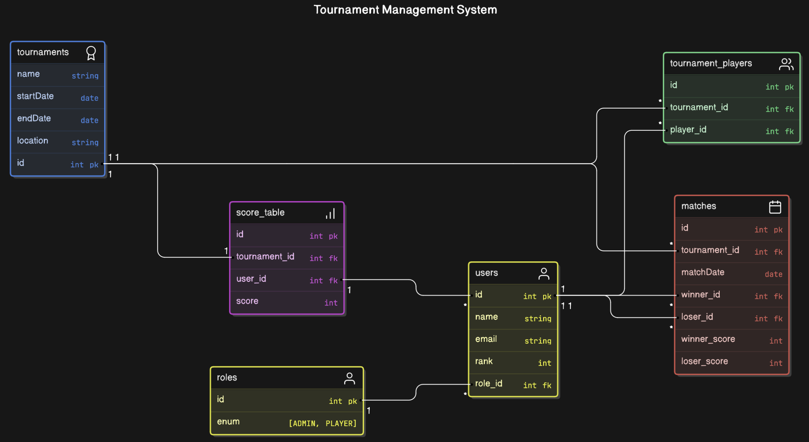

# Project setup

```bash
$ yarn install
```

## Compile and run the project

```bash
# development
$ yarn run start

# watch mode
$ yarn run start:dev

# production mode
$ yarn run start:prod
```

## Run tests

```bash
# unit tests
$ yarn run test

# e2e tests
$ yarn run test:e2e

# test coverage
$ yarn run test:cov
```

# ERD diagram



# Production dependencies

```bash
yarn add pg @nestjs/swagger @nestjs/typeorm @nestjs/common class-transformer class-validator typeorm @nestjs/config @nestjs/passport passport passport-local passport-jwt @nestjs/jwt
```

# Development dependencies

```bash
yarn add jest --dev
```

# Folder structure

```bash
20241002_ECOMMERCE_NESTJS/
│
├── dist/
├── node_modules/
├── src/
├── test/
├── .env
├── .eslintrc.js
├── .gitignore
├── .prettierrc
├── Enunciado Prueba NestJS - M6.pdf
├── image.png
├── nest-cli.json
├── package.json
├── README.md
├── tsconfig.build.json
├── tsconfig.json
└── yarn.lock

```

# Commits Guide

This project follows the **Conventional Commits** standard for maintaining a clear and structured commit history. The following describes the rules and how to commit correctly.

## Commit Message Structure

A commit message must follow the following structure:

<type>[optional scope]: <description>.

[optional body]

[optional footer]

### Example

```bash
feat(auth): add login functionality

Added login feature to the authentication module.
```

```bash
BREAKING CHANGE: removed old login API endpoints
```

## Commit types

The allowed commit types are as follows:

- **build**: Changes that affect the build system or external dependencies (e.g. webpack, npm).
- **chore**: Changes in the development process that do not affect the production code (e.g. tool configuration).
- **CI**: Changes to CI configuration files and scripts (e.g. GitHub Actions, CircleCI).
- **docs**: Changes to documentation (e.g. README, wiki).
- **feat**: New end-user feature.
- **fix**: Bug fixes.
- **perf**: Changes that improve performance.
- **refactor**: Changes to code that do not fix bugs or add features (e.g. renaming variables).
- **style**: Changes that do not affect the meaning of the code, only the way it is written (e.g. formatting).
- **test**: Adding tests or correcting existing tests.
- **reverting**: Reverting a previous commit.

## Commit rules

- **non-empty type**: The type of the commit must not be empty.
- **Non-empty subject**: The subject of the commit must not be empty.
- **Header length**: The commit header must have a maximum length of 72 characters.
- **Valid type**: The type of the commit must be in the list of allowed types.
- **Body formatting**: The body of the commit, if included, must start with a blank line after the description and may contain multiple paragraphs.

## Commit messages

Here are some examples of how to structure your commit messages:
t

- **add a new feature**:
  feat(auth): add login functionalityty

- **Fix a bug**:
  fix(parser): handle empty input

- **Change API**:
  feat(api)!: remove deprecated endpoints

- **Update documentation**:
  docs: update README with installation instructions

- **Revert a change**:
  revert: let us never again speak of the noodle incident

Reverts commit 676104e.

## Why Use Conventional Commits

- Automatic generation of CHANGELOGs:\*\* Makes it easy to create changelogs.
- Automatic determination of version incrementation:\*\* Based on the types of commits made.
- Clear communication of changes:\*\* Facilitates understanding of changes for team members and other stakeholders.
- Enabling build and release processes:\*\* Enables automation of continuous integration and delivery.
- Facilitates contributions:\*\* Makes commit history more accessible to new contributors.
